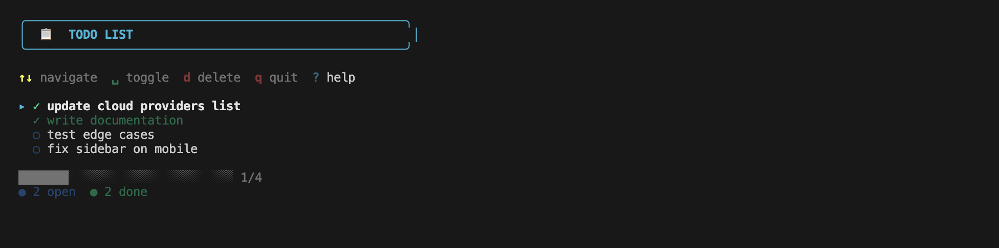
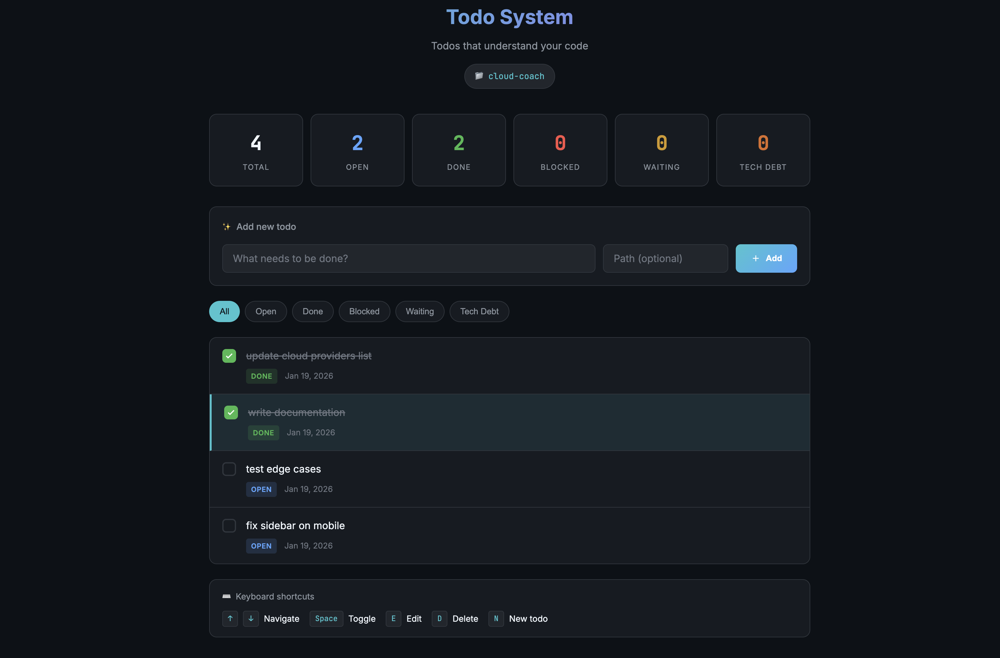

# Todo CLI

<p align="center">
  <strong>🗂️ Project-embedded interactive todo system for developers</strong><br>
  <em>Todos that understand your code</em>
</p>

<p align="center">
  <a href="#installation">Installation</a> •
  <a href="#quick-start">Quick Start</a> •
  <a href="#commands">Commands</a> •
  <a href="#web-ui">Web UI</a>
</p>

---

## ✨ Features

- **📁 Project-local storage** - Todos stored in `.todos/` directory within your project
- **🎯 Context-aware** - Attach todos to file paths, folders, or patterns
- **🔀 Git integration** - Automatically captures branch and commit context
- **⌨️ Interactive CLI** - Navigate, toggle, and delete todos with keyboard shortcuts
- **🌐 Web UI** - Optional modern dark-themed web interface
- **🔍 Orphan detection** - Find todos linked to non-existent files
- **🏥 Health checks** - Doctor command to maintain todo hygiene

## 📸 Screenshots

### Interactive Todo List
Navigate your todos with vim-style keybindings. Toggle status, delete, and manage todos without leaving your terminal.



### Focus Mode
See what matters right now. Filter todos by current git branch and prioritize your work.


### Web UI
Terminal-inspired dark theme with light mode toggle. Add, edit, and manage todos from your browser.



## Installation

```bash
brew install bagadi-alnour/tap/todo
```

## Quick Start

```bash
# Initialize a todo project
todo init

# Add your first todo
todo add "Setup authentication system"

# Add a todo with context
todo add "Refactor middleware" --path src/middleware/

# List todos interactively
todo list

# Mark a todo as done
todo done 1

# Start web UI
todo ui
```

## Commands

### `todo init`
Initialize a new todo project in the current directory.

```bash
todo init           # Create .todos/ directory
todo init --force   # Reinitialize existing project
```

### `todo add`
Add a new todo item.

```bash
todo add "Fix login bug"
todo add "Refactor auth" --path src/auth
todo add "Update tests" --path src/tests --path src/utils
todo add "Quick fix" --no-git      # Skip git context capture
todo add "Important" --priority high
```

### `todo list`
List todos with interactive navigation.

```bash
todo list                 # Interactive mode (default)
todo list --static        # Non-interactive output
todo list --status open   # Filter by status
todo list --path src/     # Filter by path
```

**Keyboard Shortcuts:**

| Key | Action |
|-----|--------|
| `↑`/`↓` or `j`/`k` | Navigate up/down |
| `Space` or `Enter` | Toggle status |
| `d` or `x` | Delete todo |
| `g` | Jump to top |
| `G` | Jump to bottom |
| `?` | Show help |
| `q` | Quit |

### `todo done`
Mark a todo as complete.

```bash
todo done 1         # By list index
todo done abc123    # By ID (partial match supported)
```

### `todo focus`
Show todos relevant to your current context.

```bash
todo focus         # Branch-relevant todos
todo focus --all   # All open todos
```

### `todo doctor`
Run health checks on your todo list.

```bash
todo doctor        # Check for issues
todo doctor --fix  # Auto-fix where possible
```

**Health Checks:**
- 🔍 Orphaned paths (todos pointing to deleted files)
- ⚠️ Empty todos
- 🔄 Duplicate todos
- ⏰ Stale todos (open > 30 days)

### `todo ui`
Start the web interface.

```bash
todo ui              # Start on port 8080
todo ui --port 3000  # Custom port
```

## Web UI

The web UI provides a modern, keyboard-friendly interface for managing todos:

- **Dashboard** with status overview
- **Quick add** form with path support
- **Filter** by status (All, Open, Done, Blocked, Waiting, Tech Debt)
- **Keyboard shortcuts** for power users
- **Real-time updates** - changes sync immediately

Access at `http://localhost:8080` after running `todo ui`.

## Storage Format

Todos are stored in `.todos/todos.json`:

```json
{
  "version": 1,
  "todos": [
    {
      "id": "a3f9c2d1e4b5...",
      "text": "Refactor authentication",
      "status": "open",
      "priority": "high",
      "createdAt": "2026-01-19T10:00:00Z",
      "updatedAt": "2026-01-19T10:00:00Z",
      "context": {
        "paths": ["src/auth/"],
        "branch": "feature/auth-refactor",
        "commit": "abc1234"
      }
    }
  ]
}
```

## Status Types

| Status | Icon | Description |
|--------|------|-------------|
| `open` | ○ | Active, needs to be done |
| `done` | ✓ | Completed |
| `blocked` | ⊘ | Waiting on external dependency |
| `waiting` | ◷ | Paused, will resume later |
| `tech-debt` | △ | Known technical debt to address |

## Philosophy

> **The tool is global. The data is local.**

1. 🌍 **Install once, use everywhere** - Single binary, works in any project
2. 📁 **Todos live with the code** - Context matters, todos travel with your repo
3. ⌨️ **CLI-first** - Fast, keyboard-driven, scriptable
4. 👁️ **Human-readable** - JSON storage, easy to inspect and edit
5. 🔀 **Git-aware** - Understands your development workflow

## Configuration

Configuration is stored in `.todos/config.json`:

```json
{
  "version": 1,
  "autoGit": true,
  "defaultBranch": "main"
}
```

## Git Integration

Todo CLI automatically captures git context when adding todos:

- **Branch name** - What feature/fix you're working on
- **Commit hash** - Point-in-time reference

Use `todo focus` to see todos relevant to your current branch.

## Development

```bash
# Build
make build

# Run tests
make test

# Install locally
make install

# Format code
make fmt

# Run linter
make lint
```

## Contributing

Contributions are welcome! Please feel free to submit a Pull Request.

## License

MIT License - see [LICENSE](LICENSE) for details.

---

<p align="center">
  Made with ❤️ for developers who like their todos close to their code
</p>
