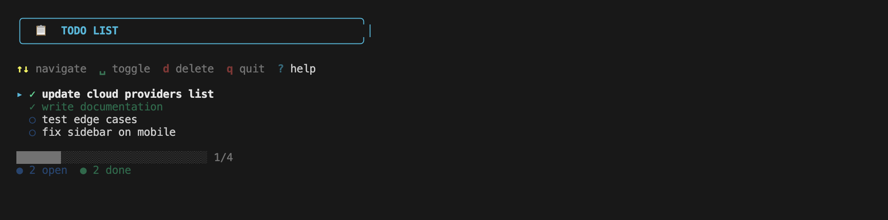
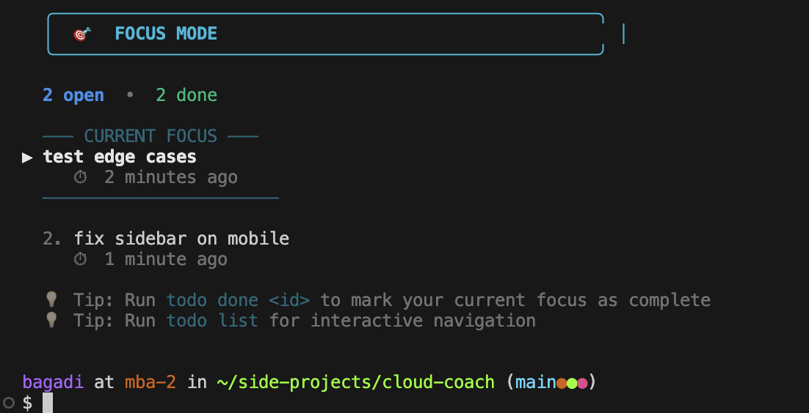
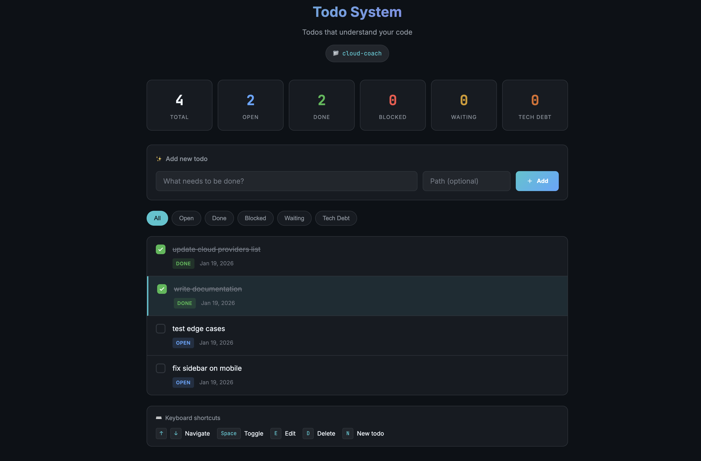

# Todo CLI

<p align="center">
  <strong>Project-embedded interactive todo system for developers</strong><br>
  <em>Todos that understand your code</em>
</p>

<p align="center">
  <a href="https://github.com/bagadi-alnour/todo-cli/actions/workflows/ci.yml"></a>
  <a href="https://github.com/bagadi-alnour/todo-cli/releases/latest"></a>
  
  <a href="LICENSE"></a>
</p>

<p align="center">
  <a href="#quick-start">Quick Start</a> •
  <a href="#installation">Installation</a> •
  <a href="#commands">Commands</a> •
  <a href="#scripting---json-output">JSON</a> •
  <a href="#web-ui">Web UI</a> •
  <a href="#storage-format">Storage</a> •
  <a href="#roadmap">Roadmap</a>
</p>

---

## Why not GitHub Issues, Linear, or Todoist?

Those tools are great for team-level work. `todo` is for **project-local developer memory**:

- Tasks tied to **files and folders** — know exactly where work lives.
- **Branch-aware context** — `todo context` shows what matters right now.
- **Survives context switching** — come back tomorrow and run `todo next`.
- **Works offline** — no cloud, no account, no sync.
- **Stores data beside the code** — `.todos/` is plain JSON you can grep, inspect, backup, or commit.
- **Scriptable** — `--json` everywhere, pipe into `jq`, integrate with editors and CI.

## Quick Start

Get going in 30 seconds:

```bash
todo init
todo add "Fix auth bug" --path src/auth --priority high --tag backend
todo list
todo next
todo done 1
```

## Features

- **Project-local storage** — Todos live in `.todos/` inside each repo (optionally committed for the team).
- **Context-aware** — Attach file paths; git branch and commit captured automatically.
- **Branch view** — `todo context` shows todos for the current branch. `todo here` shows todos for the current directory.
- **Tags and due dates** — Filter with `--tag`, `--overdue`, `--due-before`, `--due-after`.
- **Notes** — Longer descriptions via `--notes` on `add` / `edit`.
- **Smart next task** — `todo next` ranks by overdue, due date, priority, then age, and tells you *why*.
- **Task dependencies** — `--blocked-by` and `--blocks` link todos; `todo show` displays the graph.
- **Recurring tasks** — `--recur daily|weekly|monthly`; completing auto-creates the next occurrence.
- **Source scan** — `todo scan` parses `TODO`/`FIXME` comments from source files and imports them.
- **Interactive list** — Keyboard-driven TUI (`todo list`); `--static` for pipes/CI.
- **Focus mode** — `todo focus` surfaces work for the current branch.
- **Stats dashboard** — `todo stats` for counts, tags, completion rate, overdue, and time-to-done.
- **Search** — `todo search "<query>"` across text, notes, tags, and paths.
- **Archive** — Move completed items to `.todos/archive.json`.
- **Import / Export** — `todo export --format markdown` or `todo import backup.json`.
- **Watch mode** — `todo watch` polls for changes and emits JSON events for editor integrations.
- **Health checks** — `todo doctor` (optional `--fix`).
- **File locking** — Safe when multiple terminals run `todo add` simultaneously.
- **Atomic writes** — Data files are written via temp file + fsync + rename.
- **Web UI** — Local server (default port **17887**).
- **Scripting** — `--json` on every read command; `--verbose` for diagnostics.

## Screenshots

### Interactive Todo List



### Focus Mode



### Web UI



## Installation

Requires **Go 1.22+** to build from source.

### macOS

```bash
# Homebrew (recommended)
brew install bagadi-alnour/tap/todo

# From source
git clone https://github.com/bagadi-alnour/todo-cli.git
cd todo-cli && ./scripts/install.sh
```

### Linux

```bash
git clone https://github.com/bagadi-alnour/todo-cli.git
cd todo-cli && ./scripts/install.sh

# Or install with Go
go install github.com/bagadi-alnour/todo-cli/cmd/todo@latest
```

### GitHub Releases

Pre-built binaries for Linux, macOS, and Windows are available on the [Releases](https://github.com/bagadi-alnour/todo-cli/releases) page.

### Cross-build binaries

```bash
make build-all
# todo-darwin-{amd64,arm64}, todo-linux-{amd64,arm64}, todo-windows-amd64.exe
```

### Shell completions

The install script installs completions for your current shell. To install manually:

```bash
# Bash
todo completion bash > /etc/bash_completion.d/todo

# Zsh
mkdir -p ~/.zsh/completions
todo completion zsh > ~/.zsh/completions/_todo
# Then ensure fpath and compinit are set in ~/.zshrc:
#   fpath=(~/.zsh/completions $fpath)
#   autoload -Uz compinit && compinit

# Fish
mkdir -p ~/.config/fish/completions
todo completion fish > ~/.config/fish/completions/todo.fish

# PowerShell
todo completion powershell | Out-String | Invoke-Expression
# Persist by adding to $PROFILE
```

`--path` / `-p` on `add`, `edit`, `list`, `next`, and `search` completes paths relative to the project root.

## Global flags

| Flag | Meaning |
|------|---------|
| `-h`, `--help` | Help for the command |
| `--version` | Print version, commit, and build date |
| `-v`, `--verbose` | Log project root, config, and todo counts to stderr |

## Commands

### Shorthand `-p` (path vs port)

- **`todo ui`:** `-p` / `--port` is the **TCP port** (default **17887**).
- **All other commands** that expose `-p`: it is a **path** (same as `--path`).

---

### `todo init`

Create `.todos/`, `todos.json`, and `config.json` in the current directory.

```bash
todo init
todo init --force   # Reinitialize
```

---

### `todo add`

```bash
todo add "Fix login bug"
todo add "Refactor auth" --path src/auth -p src/types
todo add "Quick fix" --no-git
todo add "Important" --priority high
todo add "Launch" --tag release --tag qa --due tomorrow
todo add "Spec" --notes "See doc/design.md"
todo add "API" --json --no-git
todo add "Weekly audit" --recur weekly --due 2026-06-01
todo add "DB migration" --blocked-by abc123
todo add "Ship feature" --blocks def456
```

Due date supports: `YYYY-MM-DD`, `YYYY-MM-DDTHH:MM`, RFC3339, `today`, `tomorrow`, `+2d`.

---

### `todo list` (`todo ls`)

Default: **interactive TUI** when stdout is a TTY.

```bash
todo list --static
todo list -s open
todo list --status done
todo list -p src/
todo list --priority high
todo list -t backend -t frontend
todo list --overdue
todo list --due-before 2026-03-01
todo list --json
```

**Interactive keys**

| Key | Action |
|-----|--------|
| `↑` `↓` or `j` `k` | Move selection |
| `Space` / `Enter` | Toggle status (confirm `Y` when marking done; re-open is instant) |
| `d` `x` | Delete (confirm `Y` / cancel `N` `q` `Esc`) |
| `g` / `G` | Jump to first / last |
| `?` `h` `H` | Help overlay |
| `q` / `Esc` | Quit |

---

### `todo show`

Display full details of a single todo.

```bash
todo show 1
todo show abc123
todo show 1 --json
```

---

### `todo edit`

```bash
todo edit 1 --text "New title"
todo edit 1 --status blocked
todo edit 1 --priority low
todo edit 1 -p cmd/foo.go --path cmd/bar.go
todo edit 1 --clear-paths
todo edit 1 -t backend --tag security
todo edit 1 --add-tag ops --remove-tag backend
todo edit 1 --clear-tags
todo edit 1 --due +3d
todo edit 1 --clear-due
todo edit 1 --notes "Longer description"
todo edit 1 --clear-notes
todo edit 1 --blocked-by abc123
todo edit 1 --blocks def456
todo edit 1 --clear-blocked-by
todo edit 1 --recur weekly
todo edit 1 --clear-recur
```

---

### `todo done`

Mark one or more items done (by index or ID).

```bash
todo done 1
todo done 1 2 3
todo done a3f9c2d1
```

---

### `todo delete` (`del`, `rm`)

```bash
todo delete 2
todo delete 1 3 5
```

---

### `todo status` (`set-status`)

Last argument is the new status. All preceding are IDs or indices.

```bash
todo status 1 blocked
todo status 1 2 3 done
```

Statuses: `open`, `done`, `blocked`, `waiting`, `tech-debt`.

---

### `todo focus`

```bash
todo focus              # open todos on current branch
todo focus --all        # all open todos
todo focus --priority high
todo focus --json
```

---

### `todo next`

```bash
todo next
todo next --all
todo next -t backend
todo next -p src/auth --priority high
todo next --json
```

---

### `todo context`

Show todos for the current Git branch.

```bash
todo context
todo context --json
```

---

### `todo here`

Show todos related to the current directory.

```bash
cd src/auth && todo here
todo here --json
```

---

### `todo search`

Case-insensitive match on text, notes, tags, and paths.

```bash
todo search "auth"
todo search "billing" -s open
todo search "api" -t backend -p src/
todo search "fix" --json
```

---

### `todo stats`

```bash
todo stats
todo stats --json
```

---

### `todo archive`

Move **done** items from `todos.json` into `.todos/archive.json`.

```bash
todo archive
todo archive --before 2025-12-31
todo archive --json
```

---

### `todo export`

```bash
todo export                        # JSON to stdout
todo export --format markdown      # Markdown checklist
todo export --format json > backup.json
```

---

### `todo import`

Import todos from a previously exported JSON file. Duplicate IDs are skipped.

```bash
todo import backup.json
todo import ../other-project/.todos/todos.json
```

---

### `todo doctor`

```bash
todo doctor
todo doctor --fix
todo doctor --json
```

Checks: project init, todos file, config file, git repo, write access.

---

### `todo ui`

```bash
todo ui                    # default port 17887
todo ui --port 3000
todo ui -p 9000
```

Open `http://localhost:17887` (or your chosen port).

---

### `todo scan`

Parse `TODO`, `FIXME`, `HACK`, and `XXX` comments from source files and import them as todos.

```bash
todo scan                         # Scan current directory
todo scan src/                    # Scan specific directory
todo scan --dry-run               # Preview without importing
todo scan --tag code-review       # Tag all imported todos
todo scan --json
```

---

### `todo watch`

Watch `.todos/` for changes and emit JSON events to stdout. Useful for editor integrations or status bars.

```bash
todo watch                  # Poll every 2 seconds
todo watch --interval 5     # Poll every 5 seconds
```

---

### `todo config`

```bash
todo config
todo config --auto-git false
todo config --default-branch main
todo config --reset
```

---

### `todo completion`

```bash
todo completion bash|zsh|fish|powershell
```

## Scripting — `--json` output

Commands that support `--json`:

| Command | Output shape |
|---------|-------------|
| `todo add --json` | Single todo object |
| `todo list --json` | `{ "todos", "count", "stats" }` |
| `todo show --json` | Single todo object |
| `todo next --json` | `{ "todo", "reason", "count" }` |
| `todo focus --json` | `{ "todos", "count", "branch" }` |
| `todo context --json` | `{ "branch", "todos", "count" }` |
| `todo here --json` | `{ "directory", "todos", "count" }` |
| `todo doctor --json` | Health check summary |
| `todo stats --json` | Full statistics report |
| `todo archive --json` | `{ "archived", "count" }` |
| `todo search --json` | `{ "query", "results", "count" }` |
| `todo scan --json` | `{ "found", "count" }` |
| `todo export` | TodoFile object or Markdown |

Examples:

```bash
# High-priority open todos
todo list --json | jq '.todos[] | select(.priority == "high" and .status == "open")'

# Count by status
todo stats --json | jq '.byStatus'

# Todos for a specific path
todo here --json | jq '.todos[].text'
```

## Web UI

- Dashboard-style overview with filters, keyboard shortcuts, and live updates.
- Reads the same `.todos/` files as the CLI — no separate database.
- **No cloud sync. No account. No background daemon.**
- Default port: **17887**. Override with `--port`.

## Workflow examples

```bash
# During code review
todo add "Refactor auth middleware after review" -p internal/auth --tag review

# Before switching branches
todo add "Finish migration cleanup" --priority high --tag migration

# Coming back to a project
todo next

# See what's relevant in this directory
cd src/billing && todo here

# See what's on this branch
todo context

# Project handoff — show all billing-related work
todo list --json -p src/billing | jq '.todos[] | {text, status, priority}'

# Export for a teammate
todo export --format markdown > TODO.md

# Set up a recurring reminder
todo add "Dependency audit" --recur weekly --due 2026-06-01 --tag maintenance

# Link related tasks
todo add "Write API endpoints" --blocks abc123
todo edit 1 --blocked-by def456

# Scan codebase for TODO comments
todo scan --dry-run           # preview first
todo scan --tag tech-debt     # import with tag
```

## Storage format

### `.todos/todos.json`

```json
{
  "version": 1,
  "todos": [
    {
      "id": "a3f9c2d1e4b5…",
      "text": "Refactor authentication",
      "notes": "See ADR-12",
      "status": "open",
      "priority": "high",
      "tags": ["backend", "security"],
      "dueAt": "2026-01-25T23:59:59Z",
      "recur": "weekly",
      "blockedBy": ["b1c2d3e4"],
      "blocks": ["f5a6b7c8"],
      "createdAt": "2026-01-19T10:00:00Z",
      "updatedAt": "2026-01-19T10:00:00Z",
      "context": {
        "paths": ["src/auth/"],
        "branch": "feature/auth-refactor",
        "commit": "abc1234"
      },
      "meta": { "source": "cli" }
    }
  ]
}
```

### `.todos/archive.json`

Same shape as `todos.json`. Written by `todo archive`, appended over time.

### `.todos/config.json`

```json
{
  "version": 1,
  "autoGit": true,
  "defaultBranch": "main"
}
```

Your data is plain JSON. Grep it, commit it, back it up, import it elsewhere.

## Sharing `.todos/` via Git

Committing `.todos/` lets your team share todos across branches. This works well in practice, but be aware of merge conflicts.

### Handling merge conflicts

When two branches both modify `todos.json` and get merged, Git may produce a conflict. The safest resolution strategy:

1. **Accept the incoming version** — pick whichever side has more data (typically the longer file).
2. **Re-import the other** — export the losing side first (`todo export > /tmp/theirs.json`), resolve the conflict, then `todo import /tmp/theirs.json`. Duplicate IDs are automatically skipped.
3. **Or merge manually** — `todos.json` is a flat JSON array. Copy missing todo objects from the conflicting side into the `"todos"` array, ensuring unique IDs.

**Recommended `.gitattributes`** to reduce noise:

```gitattributes
.todos/todos.json   merge=union
.todos/archive.json merge=union
```

The `merge=union` strategy keeps lines from both sides during a merge, which works for append-only JSON arrays. After a union merge, run `todo doctor --fix` to validate and deduplicate.

**Preventing conflicts entirely:**

- Use short-lived branches.
- Each developer adds todos on their own branch; merge frequently.
- Use `todo export` / `todo import` for cross-branch sharing instead of committing `.todos/`.

## Status types

| Status | Icon | Meaning |
|--------|------|---------|
| `open` | ○ | Active |
| `done` | ✓ | Completed |
| `blocked` | ⊘ | Blocked on dependency |
| `waiting` | ◷ | Paused |
| `tech-debt` | △ | Tech debt |

## Philosophy

> **The tool is global. The data is local.**

1. One binary, any repo.
2. Todos live next to the code they describe.
3. CLI-first; JSON and flags for automation.
4. Human-readable JSON on disk — no lock-in.
5. Git-aware defaults (`autoGit`, branch on add, `todo focus`, `todo context`).

## Development

```bash
make build          # embeds version + commit via ldflags
make test
make install        # copies binary to ~/bin
make install-global # copies to /usr/local/bin (sudo)
make fmt
make lint           # requires golangci-lint
make completions
```

### Git hooks

After clone, set up the commit-msg hook:

```bash
git config core.hooksPath githooks
```

### Releases

Releases are automated via [GoReleaser](https://goreleaser.com/). Push a tag to create a release:

```bash
git tag v0.4.0
git push origin v0.4.0
```

## Roadmap

- [ ] Editor integrations (VS Code, Neovim) — sidebar panel and inline diagnostics
- [ ] Markdown import (parse `- [ ]` lists)
- [ ] `todo context` auto-filter by changed files
- [ ] Web UI improvements (drag-and-drop, dark mode, live SSE updates via `todo watch`)
- [ ] Subtask nesting (parent/child relationships)

## Contributing

Contributions are welcome via Pull Request.

## License

MIT — see [LICENSE](LICENSE).
